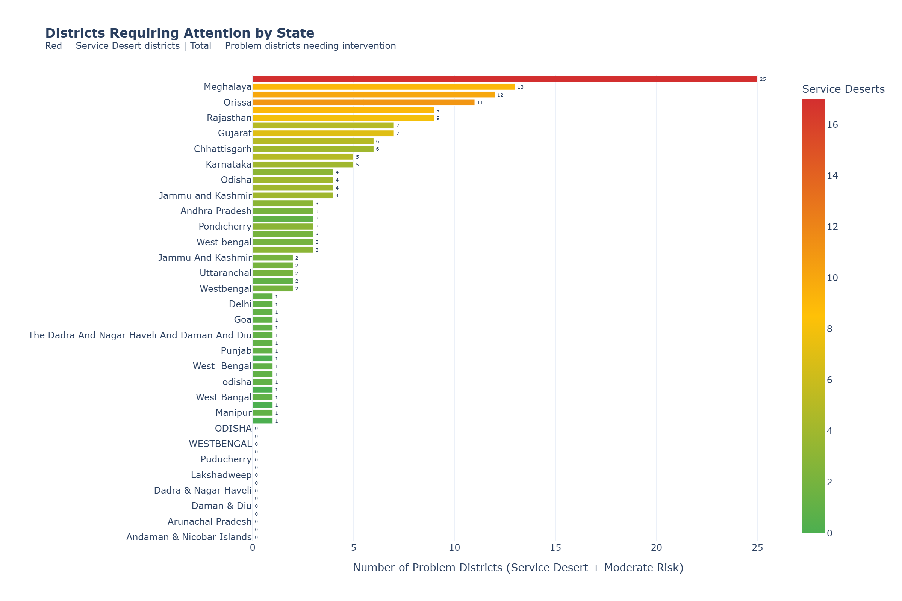
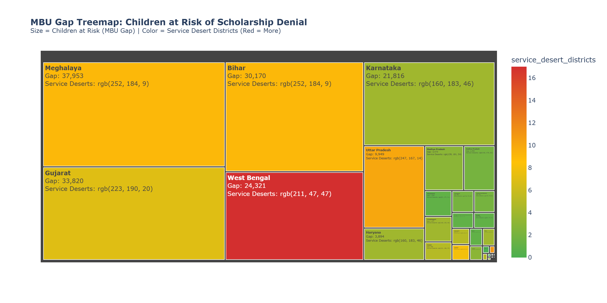
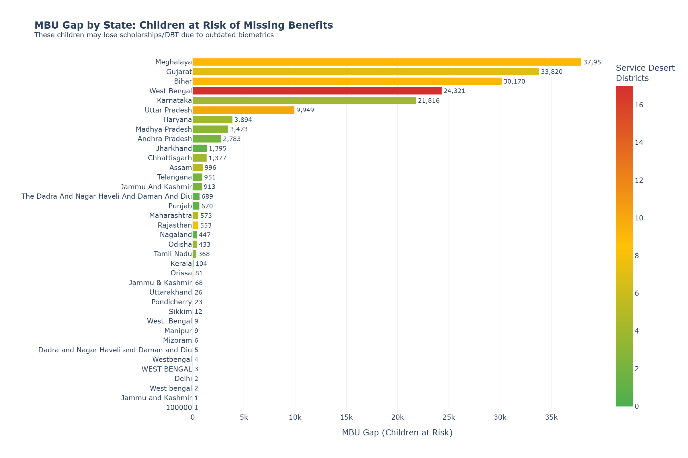
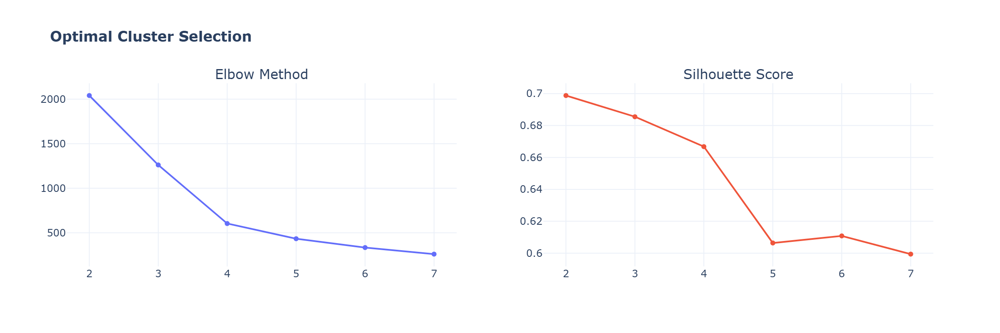
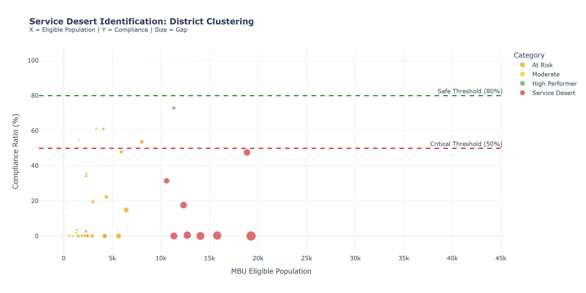
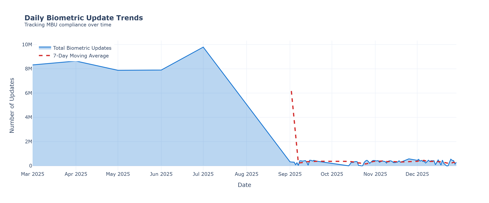
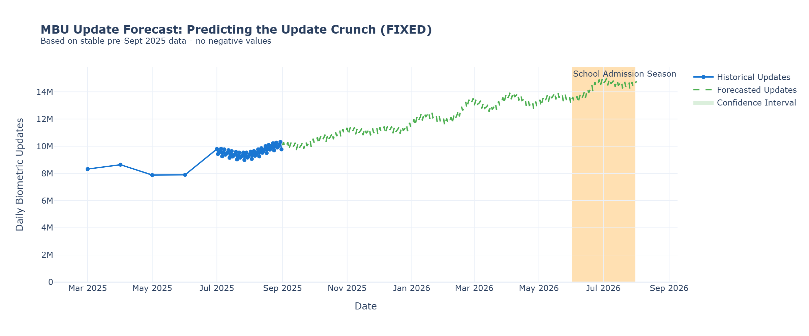
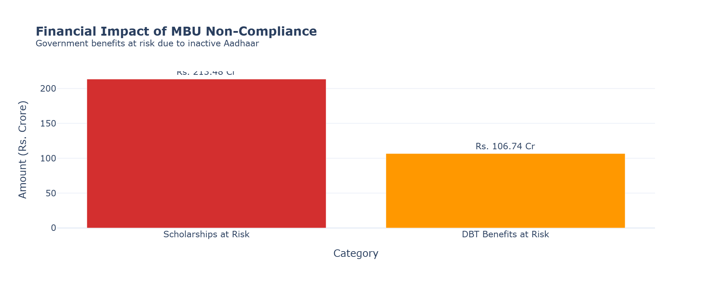

<p align="center">
  
</p>

<h1 align="center">MBU Gap Analyzer</h1>
<h3 align="center">Predictive Gap Analysis Engine for Mandatory Biometric Updates</h3>

<p align="center">
  <strong>UIDAI Data Hackathon 2026 Submission</strong>
</p>

<p align="center">
  <a href="#problem-statement">Problem</a> •
  <a href="#solution">Solution</a> •
  <a href="#key-features">Features</a> •
  <a href="#visualizations">Visualizations</a> •
  <a href="#installation">Installation</a> •
  <a href="#tech-stack">Tech Stack</a> •
  <a href="#team">Team</a>
</p>

<p align="center">
  
  
  
  
  
  
</p>

<p align="center">
  
  
</p>

---

## 📋 Table of Contents

- [Problem Statement](#-problem-statement)
- [Our Solution](#-our-solution)
- [Key Features](#-key-features)
- [Deep Learning Edition](#-deep-learning-edition-new)
- [Architecture](#-architecture)
- [Key Findings](#-key-findings)
- [Visualizations](#-visualizations)
- [Installation](#-installation)
- [Usage](#-usage)
- [Dataset Structure](#-dataset-structure)
- [Tech Stack](#-tech-stack)
- [Policy Recommendations](#-policy-recommendations)
- [Team](#-team)

---

## 🎯 Problem Statement

### The Hidden Crisis: Children Losing Benefits Due to MBU Non-Compliance

Children enrolled in Aadhaar are **mandated** to update their biometrics at two critical life stages:

| Age | Update Type | Reason |
|:---:|:------------|:-------|
| **5 years** | Mandatory Biometric Update | Fingerprints mature, facial features change |
| **15 years** | Mandatory Biometric Update | Adolescent biometric changes |

### What Happens If They Don't Update?

```
❌ Aadhaar becomes INACTIVE
   ├── 🚫 School admission blocked
   ├── 🚫 Scholarship disbursement fails
   ├── 🚫 Mid-day meal authentication fails
   └── 🚫 DBT (Direct Benefit Transfer) denied
```

### The Scale of the Problem

> **Thousands of children risk losing government benefits worth crores of rupees annually** because their Aadhaar wasn't updated on time — often due to lack of awareness or inaccessible update centers.

---

## 💡 Our Solution

### MBU Gap Analyzer: A 3-Layer Predictive Engine

We built an intelligent system that identifies **"Ghost Cohorts"** — children who were enrolled in Aadhaar but never completed their Mandatory Biometric Updates.

```
┌─────────────────────────────────────────────────────────────────┐
│                    MBU GAP ANALYZER                             │
├─────────────────────────────────────────────────────────────────┤
│                                                                 │
│   Layer 1: COHORT TRACKING                                      │
│   ├── Track children from enrolment → MBU age                   │
│   ├── Calculate MBU Compliance Ratio per district               │
│   └── Identify "Ghost Cohorts" with high gap                    │
│                                                                 │
│   Layer 2: SERVICE DESERT IDENTIFICATION                        │
│   ├── K-Means clustering on district performance                │
│   ├── Identify underserved areas                                │
│   └── Priority ranking for intervention                         │
│                                                                 │
│   Layer 3: SCHOLARSHIP RISK PREDICTION                          │
│   ├── Time series analysis of update trends                     │
│   ├── Forecast "Update Crunch" periods                          │
│   └── Predict children at risk before admission season          │
│                                                                 │
└─────────────────────────────────────────────────────────────────┘
```

---

## ✨ Key Features

<table>
<tr>
<td width="50%">

### 📊 Cohort Tracking
- Aggregates **5M+ records** across enrolment, biometric, and demographic data
- Computes district-wise MBU Compliance Ratio
- Risk classification: Green / Yellow / Red zones

</td>
<td width="50%">

### 🗺️ Service Desert Mapping
- K-Means clustering identifies underserved districts
- Silhouette analysis for optimal cluster selection
- Priority list for Aadhaar Seva Kendra deployment

</td>
</tr>
<tr>
<td width="50%">

### 📈 Predictive Forecasting
- 6-month ahead predictions using Prophet/Linear Regression
- Identifies "Update Crunch" before school admission season
- Confidence intervals for resource planning

</td>
<td width="50%">

### 💰 Impact Quantification
- Calculates scholarships at risk (Rs. Crore)
- DBT benefits potentially blocked
- Actionable financial impact for policymakers

</td>
</tr>
</table>

---

## 🚀 Deep Learning Edition (NEW!)

> **Branch:** `deep-learning` | **Notebook:** `MBU_Gap_Analyzer_DeepLearning.ipynb`

We've enhanced the standard ML solution with **4 cutting-edge Deep Learning modules** to deliver a production-ready, hackathon-winning submission.

### Module Overview

| # | Module | Technology | Purpose |
|:-:|:-------|:-----------|:--------|
| 1 | **LSTM Forecaster** | PyTorch | Time-series prediction for MBU demand during school admission rush |
| 2 | **Autoencoder Anomaly** | PyTorch | Unsupervised detection of suspicious districts with abnormal patterns |
| 3 | **SHAP Explainability** | SHAP Library | Explain WHY K-Means classified districts as Service Deserts |
| 4 | **Geospatial Map** | Folium | Interactive India map with color-coded Service Desert markers |

### 🧠 Module 1: LSTM Time-Series Forecaster

```
Architecture: Input → LSTM (2 layers, 64 hidden) → FC → Output
```

**LSTM (Long Short-Term Memory)** captures temporal patterns in biometric update trends to predict future MBU demand.

$$h_t = o_t \odot \tanh(C_t)$$

- **Training:** 100 epochs with Adam optimizer + learning rate scheduling
- **Output:** 6-month forecast to anticipate school admission rush (June-July 2026)
- **Use Case:** UIDAI can pre-deploy mobile Seva Kendras to high-demand districts

### 🔍 Module 2: Autoencoder Anomaly Detector

```
Encoder: 5 features → 32 → 16 → 8 (bottleneck)
Decoder: 8 → 16 → 32 → 5 features (reconstruction)
```

**Autoencoder** learns normal patterns and flags districts with high reconstruction error as anomalies.

$$\text{Anomaly if } \mathcal{L}_{reconstruction} > \mu + 2\sigma$$

- **Detection:** Districts with abnormal enrolment-to-update ratios
- **Use Case:** Identify data quality issues or potential fraud

### 📊 Module 3: SHAP Explainable AI

**SHAP (SHapley Additive exPlanations)** uses game theory to explain model decisions.

- **Method:** KernelSHAP for K-Means clustering
- **Output:** Feature importance showing why a district is classified as Service Desert
- **Use Case:** Provide transparent, auditable explanations for policy decisions

### 🗺️ Module 4: Interactive Geospatial Map

**Folium** generates an interactive HTML map of India with:

| Marker Color | Status | Compliance |
|:------------:|:-------|:-----------|
| 🔴 Red | Service Desert | < 50% |
| 🟠 Orange | At Risk | 50-80% |
| 🟢 Green | Compliant | > 80% |

- **Popups:** District name, compliance ratio, MBU gap
- **Output:** `analysis_outputs/service_desert_map.html`

### Quick Start (Deep Learning Edition)

```bash
# Switch to deep-learning branch
git checkout deep-learning

# Install additional dependencies
pip install torch shap folium

# Run the notebook
jupyter notebook MBU_Gap_Analyzer_DeepLearning.ipynb
```

---

## 🏗️ Architecture

### Core Algorithm: MBU Compliance Ratio

$$\text{MBU Compliance Ratio} = \frac{\text{Biometric Updates (Age 5-17)}}{\text{Eligible Population (Enrolments Age 0-5 + Age 5-17)}} \times 100$$

### Risk Classification Matrix

| Compliance Ratio | Risk Category | Action Required |
|:----------------:|:-------------:|:----------------|
| ≥ 80% | 🟢 **Green** (Compliant) | Maintain current operations |
| 50% - 80% | 🟡 **Yellow** (Moderate Risk) | Awareness campaigns needed |
| < 50% | 🔴 **Red** (Service Desert) | Urgent intervention required |

### Machine Learning Pipeline

```
Input Data                    Processing                      Output
─────────────────────────────────────────────────────────────────────
                             ┌──────────────┐
[Enrolment CSV] ────────────►│              │
                             │   Merge &    │     ┌─────────────────┐
[Biometric CSV] ────────────►│  Aggregate   │────►│ Gap Analysis DF │
                             │   by Dist.   │     └────────┬────────┘
[Demographic CSV] ──────────►│              │              │
                             └──────────────┘              ▼
                                                  ┌─────────────────┐
                                                  │ StandardScaler  │
                                                  └────────┬────────┘
                                                           ▼
                                                  ┌─────────────────┐
                                                  │ K-Means (k=4)   │
                                                  └────────┬────────┘
                                                           ▼
                                              ┌────────────────────────┐
                                              │  Cluster Assignment    │
                                              │  • Service Desert      │
                                              │  • At Risk             │
                                              │  • Moderate            │
                                              │  • High Performer      │
                                              └────────────────────────┘
```

---

## 📊 Key Findings

<table>
<tr>
<td align="center">
<h3>1,070+</h3>
<p>Districts Analyzed</p>
</td>
<td align="center">
<h3>177,900</h3>
<p>Children at Risk</p>
</td>
<td align="center">
<h3>147</h3>
<p>Service Desert Districts</p>
</td>
<td align="center">
<h3>Rs. 32+ Cr</h3>
<p>Benefits at Risk</p>
</td>
</tr>
</table>

### District Risk Distribution

```
Green (Compliant)     ████████████████████████████████████████  930 districts (87%)
Yellow (Moderate)     ██                                         32 districts (3%)
Red (Service Desert)  ██████                                    147 districts (14%)
```

---

## 📈 Visualizations

Our analysis generates **8 interactive visualizations** for the hackathon submission:

| # | Chart | Purpose |
|:-:|:------|:--------|
| 1 | **Problem Districts by State** | Identify states with most Service Desert + Moderate Risk districts |
| 2 | **MBU Gap Treemap** | Visualize children at risk by state (size = gap, color = severity) |
| 3 | **MBU Gap by State** | Children at risk of losing benefits per state |
| 4 | **Optimal Cluster Selection** | Elbow Method + Silhouette Score for K-Means tuning |
| 5 | **Service Desert Scatter Plot** | K-Means clustering with district-level risk categories |
| 6 | **Daily Update Trend** | Time series with 7-day moving average |
| 7 | **Forecast Chart** | Prophet-based 6-month prediction for school admission season |
| 8 | **Financial Impact Bar** | Scholarships & DBT benefits at risk (Rs. Crore) |

### Chart Gallery

#### 1. Problem Districts by State


#### 2. MBU Gap Treemap


#### 3. MBU Gap by State (Children at Risk)


#### 4. Optimal Cluster Selection (Elbow + Silhouette)


#### 5. Service Desert Identification (K-Means Clustering)


#### 6. Daily Biometric Update Trends


#### 7. MBU Forecast: Predicting the Update Crunch


#### 8. Financial Impact of MBU Non-Compliance


> 📁 All visualizations are also available as interactive HTML files in `analysis_outputs/`

### 🗺️ Interactive Service Desert Map


> **🔗 [Click here to view the Interactive India Map](https://stiwarts.github.io/UIDAI_DH_2k26/)**

Explore the **Folium-powered geospatial visualization** showing Service Desert districts across India:
- 🔴 **Red markers** = Service Desert districts (< 50% compliance)
- 🟡 **Yellow markers** = Moderate Risk districts (50-80%)
- 🟢 **Green markers** = Compliant districts (> 80%)
- **Click markers** for district-level details (MBU Gap, Compliance %)

---

## 🚀 Installation

### Prerequisites

- Python 3.10 or higher
- pip package manager
- Git

### Quick Setup

```bash
# 1. Clone the repository
git clone https://github.com/STIWARTs/UIDAI_DH_2k26.git
cd UIDAI_DH_2k26

# 2. Create virtual environment
python -m venv .venv

# 3. Activate virtual environment
# Windows (PowerShell)
.venv\Scripts\Activate.ps1
# Windows (CMD)
.venv\Scripts\activate.bat
# Linux/Mac
source .venv/bin/activate

# 4. Install all dependencies
pip install -r requirements.txt
```

### What's Included in requirements.txt

| Category | Packages |
|:---------|:---------|
| **Core Data Science** | numpy, pandas, scipy |
| **Machine Learning** | scikit-learn, shap |
| **Deep Learning** | torch (PyTorch) |
| **Time Series** | prophet |
| **Visualization** | matplotlib, plotly, folium, kaleido |
| **Jupyter** | ipykernel, ipython, jupyter_client |

> ⚡ **Note:** The full installation may take 5-10 minutes due to PyTorch and Prophet dependencies.

### Deep Learning Edition Dependencies
```bash
pip install torch shap folium kaleido
```

---

## 📖 Usage

### Run the Analysis

#### Standard ML Edition (MAIN branch)

1. **Open Jupyter Notebook**
   ```bash
   jupyter notebook MBU_Gap_Analyzer.ipynb
   ```

2. **Execute All Cells**
   - Press `Shift + Enter` to run cells sequentially
   - Or use `Cell → Run All` from menu

3. **View Outputs**
   - Interactive charts display inline
   - CSV exports saved to `analysis_outputs/` folder
   - HTML charts for PDF conversion

#### 🚀 Deep Learning Edition (deep-learning branch)

1. **Switch to deep-learning branch**
   ```bash
   git checkout deep-learning
   ```

2. **Install Deep Learning dependencies**
   ```bash
   pip install torch shap folium
   ```

3. **Open the Deep Learning notebook**
   ```bash
   jupyter notebook MBU_Gap_Analyzer_DeepLearning.ipynb
   ```

4. **Execute All Cells** - Includes 4 advanced AI modules:
   - Module 1: LSTM Time-Series Forecaster
   - Module 2: Autoencoder Anomaly Detector
   - Module 3: SHAP Explainable AI
   - Module 4: Folium Geospatial Map

### Output Files

```
analysis_outputs/
├── mbu_gap_analysis_by_district.csv    # Full gap analysis
├── state_wise_compliance_summary.csv   # State-level metrics
├── service_desert_districts.csv        # Priority intervention list
├── ghost_cohort_districts.csv          # Top 20 underperforming districts
├── chart1_state_compliance.html        # Interactive visualizations
├── chart2_gap_treemap.html
├── chart3_service_desert_scatter.html
├── chart4_daily_trends.html
├── chart5_forecast.html
├── chart6_financial_impact.html
└── service_desert_map.html             # 🆕 Interactive Folium map (Deep Learning Edition)
```

---

## 📁 Dataset Structure

```
uidai_datasets/
├── api_data_aadhar_enrolment/          # ~1M records
│   ├── api_data_aadhar_enrolment_0_500000.csv
│   ├── api_data_aadhar_enrolment_500000_1000000.csv
│   └── api_data_aadhar_enrolment_1000000_1006029.csv
│
├── api_data_aadhar_biometric/          # ~1.8M records
│   ├── api_data_aadhar_biometric_0_500000.csv
│   ├── api_data_aadhar_biometric_500000_1000000.csv
│   ├── api_data_aadhar_biometric_1000000_1500000.csv
│   └── api_data_aadhar_biometric_1500000_1861108.csv
│
└── api_data_aadhar_demographic/        # ~2M records
    ├── api_data_aadhar_demographic_0_500000.csv
    ├── api_data_aadhar_demographic_500000_1000000.csv
    ├── api_data_aadhar_demographic_1000000_1500000.csv
    ├── api_data_aadhar_demographic_1500000_2000000.csv
    └── api_data_aadhar_demographic_2000000_2071700.csv
```

### Data Schema

| Dataset | Columns |
|:--------|:--------|
| **Enrolment** | `date`, `state`, `district`, `pincode`, `age_0_5`, `age_5_17`, `age_18_greater` |
| **Biometric** | `date`, `state`, `district`, `pincode`, `bio_age_5_17`, `bio_age_17_` |
| **Demographic** | `date`, `state`, `district`, `pincode`, `demo_age_5_17`, `demo_age_17_` |

---

## 🛠️ Tech Stack

<table>
<tr>
<td align="center" width="16%">

<br><strong>Python 3.10+</strong>
<br><sub>Core Language</sub>
</td>
<td align="center" width="16%">

<br><strong>Pandas</strong>
<br><sub>Data Processing</sub>
</td>
<td align="center" width="16%">

<br><strong>NumPy</strong>
<br><sub>Numerical Computing</sub>
</td>
<td align="center" width="16%">

<br><strong>Plotly</strong>
<br><sub>Visualizations</sub>
</td>
<td align="center" width="16%">

<br><strong>Scikit-Learn</strong>
<br><sub>ML Clustering</sub>
</td>
<td align="center" width="16%">

<br><strong>PyTorch</strong>
<br><sub>Deep Learning</sub>
</td>
</tr>
<tr>
<td align="center" width="16%">

<br><strong>SHAP</strong>
<br><sub>Explainable AI</sub>
</td>
<td align="center" width="16%">

<br><strong>Folium</strong>
<br><sub>Geospatial Maps</sub>
</td>
<td align="center" width="16%">

<br><strong>Prophet</strong>
<br><sub>Time Series</sub>
</td>
<td align="center" width="16%">

<br><strong>Kaleido</strong>
<br><sub>Chart Export</sub>
</td>
<td colspan="2" align="center" width="32%">

<br><strong>Jupyter Notebook</strong>
<br><sub>Interactive Development</sub>
</td>
</tr>
</table>

---

## 📋 Policy Recommendations

Based on our analysis, we recommend the following interventions:

| # | Recommendation | Impact |
|:-:|:---------------|:-------|
| 1 | **Deploy Mobile Aadhaar Seva Kendras** in Service Desert districts | Reach underserved rural/tribal areas |
| 2 | **Launch SMS/IVR Reminder Campaigns** for children turning 5/15 | Proactive awareness |
| 3 | **Integrate MBU Status Check** with school admission portals | Flag inactive Aadhaar early |
| 4 | **Extend Fee Waiver** beyond Oct 2025 for low-compliance states | Remove financial barrier |
| 5 | **Deploy Real-time Dashboard** for District Collectors | Weekly progress monitoring |

---

## 👥 Team

<p align="center">
<strong>Team OMEGA</strong>
</p>

<p align="center">
<em>UIDAI Data Hackathon 2026</em>
</p>

---

## 📄 License

This project is submitted as part of the UIDAI Data Hackathon 2026. All rights reserved.

---

<p align="center">
<strong>Built with ❤️ for Digital India</strong>
</p>

<p align="center">
<sub>Making Aadhaar work for every child</sub>
</p>
